#### Build and push images to Docker Hub

Login to Docker Hub:
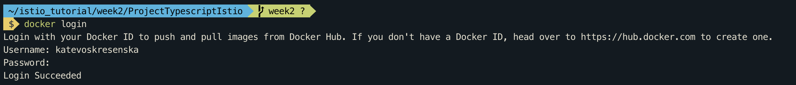

Enter each service folder, build image and push it to Docker Hub:
```bash
cd ./Project/authors
docker build -t katevoskresenska/authors-service-java:1.0 .
docker push katevoskresenska/authors-service-java:1.0

cd ./Project/books
docker build -t katevoskresenska/books-service-java:1.0 .
docker push katevoskresenska/books-service-java:1.0

cd ./Project/frontend
docker build -t katevoskresenska/frontend-service-java:1.0 .
docker push katevoskresenska/frontend-service-java:1.0
```
Check images on Docker Hub:
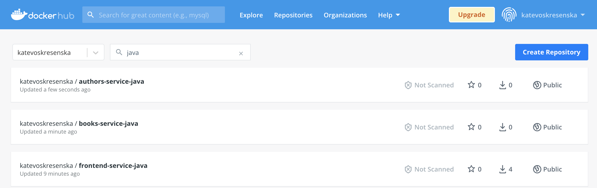

#### Deploy k8s objects
0. Install istio (if not installed):
```bash
$ curl -L https://istio.io/downloadIstio | sh -
$ cd istio-1.11.4
$ export PATH=$PWD/bin:$PATH
$ istioctl install --set profile=demo -y
```
1. Create a namespace: 
```bash
$ kubectl apply -f k8s/namespace.yaml
```

2. Enable sidecar for the istio-course namespace: 
```bash
$ kubectl label namespace istio-course istio-injection=enabled
```

3. Apply services into k8s: 
```bash
$ ./scripts/deploy-components.sh
$ ./scripts/configure-routing.sh
$ ./scripts/kubectl-get-public-ip.sh
$ kubectl -n istio-course get po
```
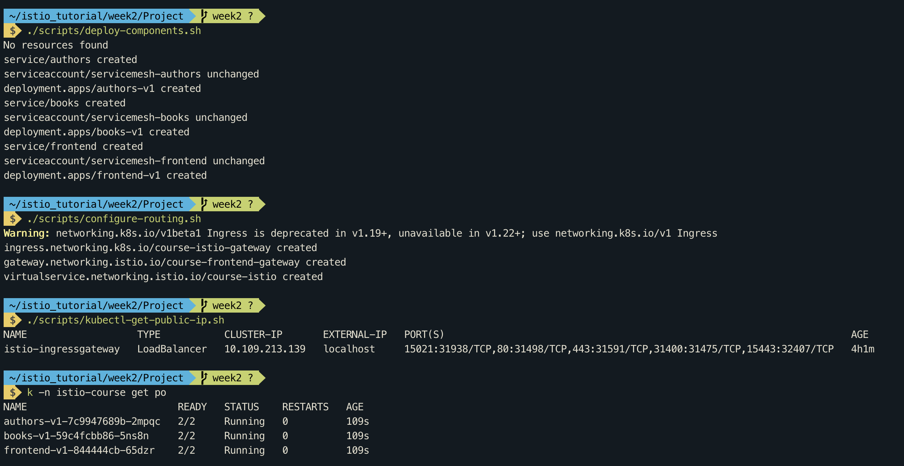

4. Delete all istio-course resources from k8s: 
```bash
$ ./scripts/delete-all.sh
```

#### Execute query against application at http://[ingress_api]/frontend-catalog/api/v1/dashboard
http://localhost/frontend-catalog/api/v1/dashboard 
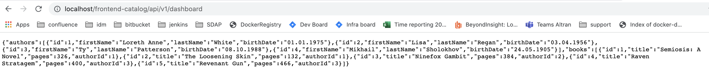

#### Open Kiali UI 
(login/password: admin/admin)

```bash
$ istioctl dashboard kiali
```
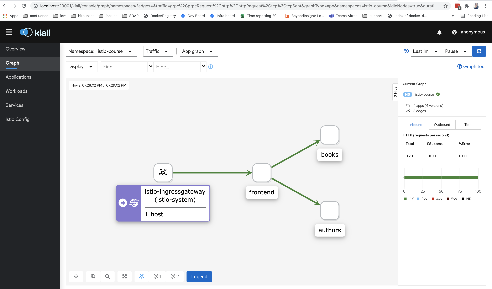
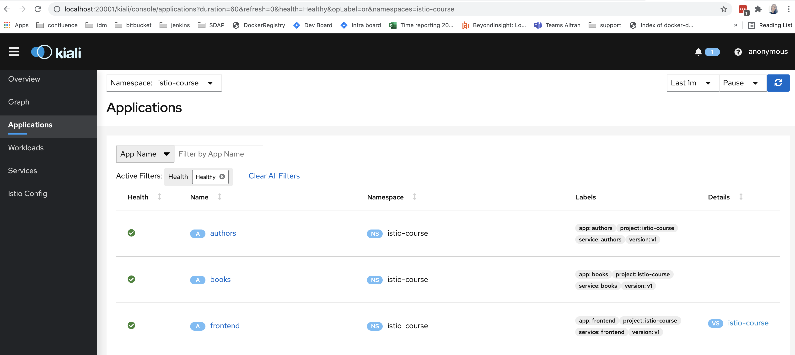

#### Open Jaeger UI 
(find traces)
```bash
$ istioctl dashboard jaeger
```
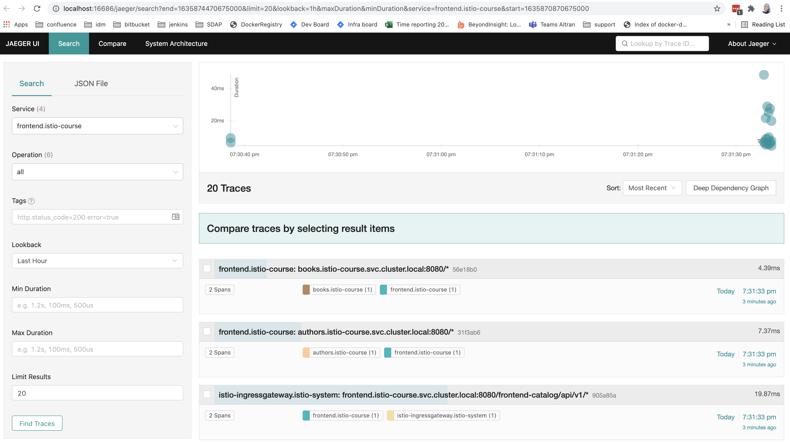

#### Open Grafana 
(use Istio Service Dashboard)
```bash
$ istioctl dashboard grafana
# add some load
$ for i in $(seq 1 100); do curl -s -o /dev/null "http://127.0.0.1/frontend-catalog/api/v1/dashboard"; done
```
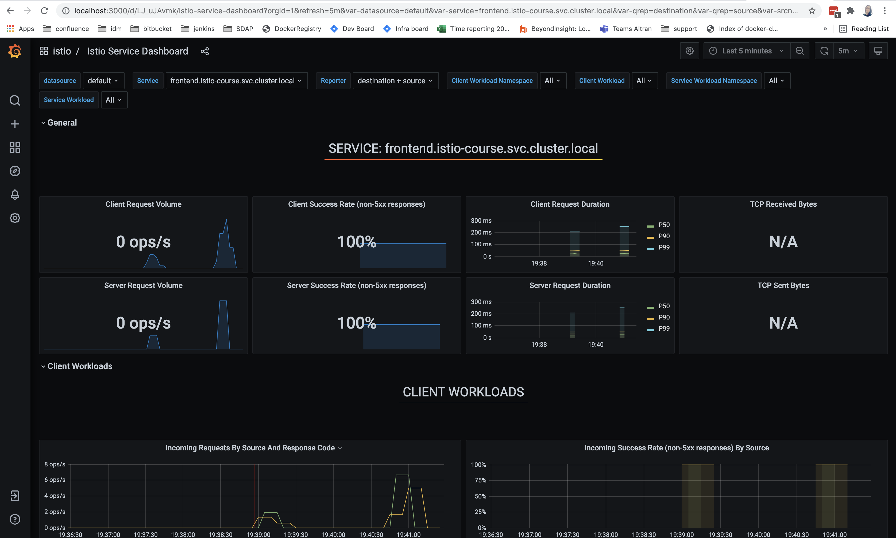
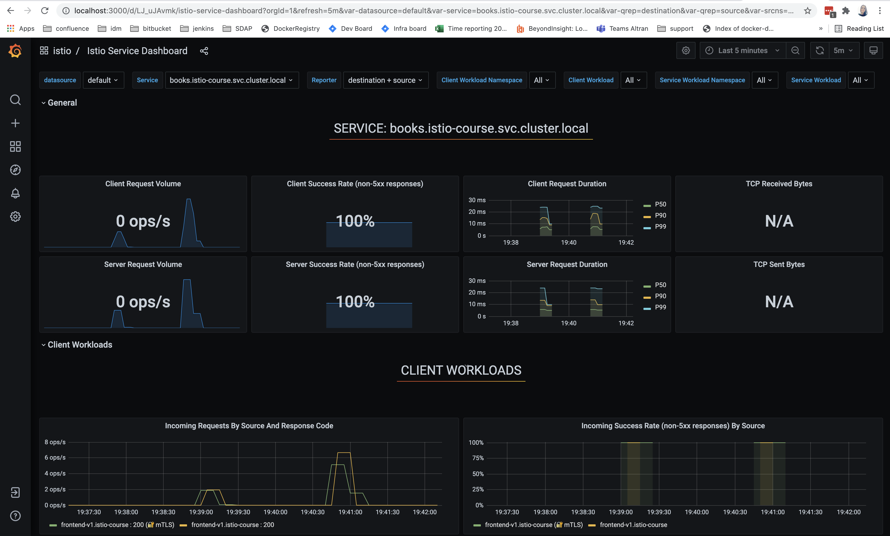
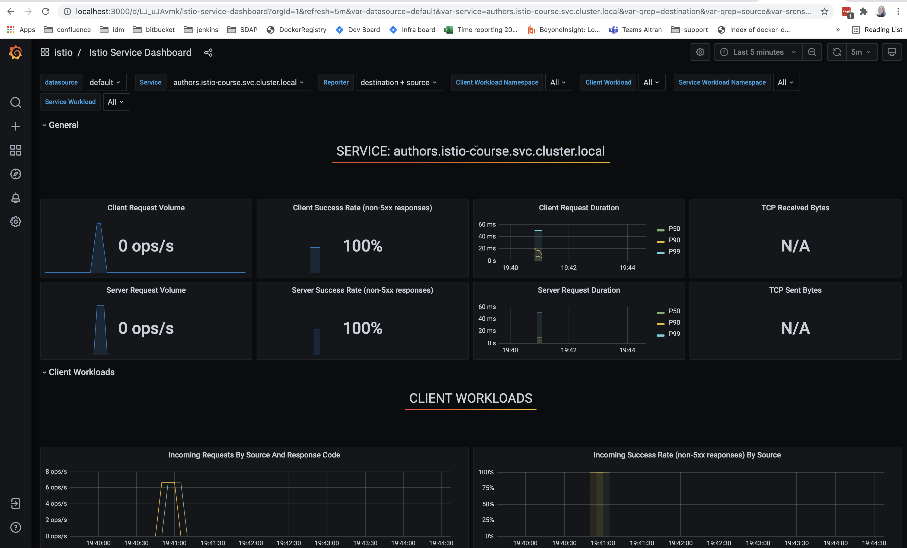

#### Install K8s metrics
```bash
$ cd k8s_metrics
$ wget https://github.com/kubernetes-sigs/metrics-server/releases/latest/download/components.yaml
# add --kubelet-insecure-tls flag to deployment
$ kubectl apply -f components.yaml
```
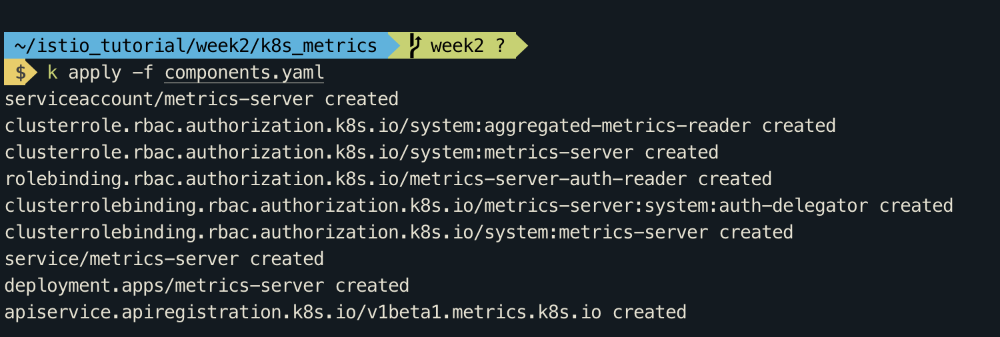
```bash
$ kubectl top node --use-protocol-buffers
$ kubectl top po -n istio-course --use-protocol-buffers
```
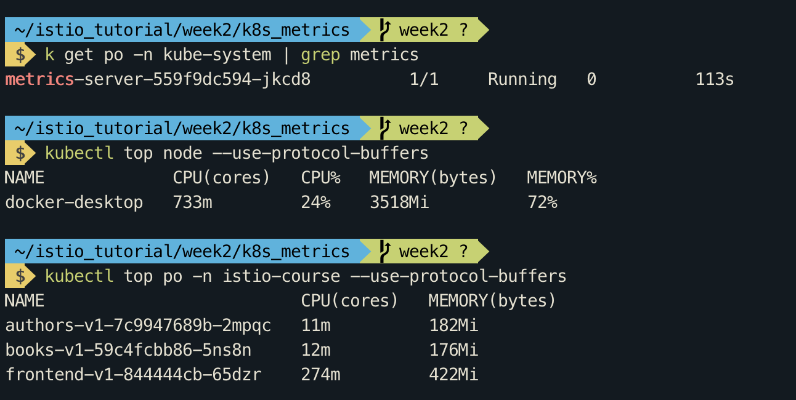


