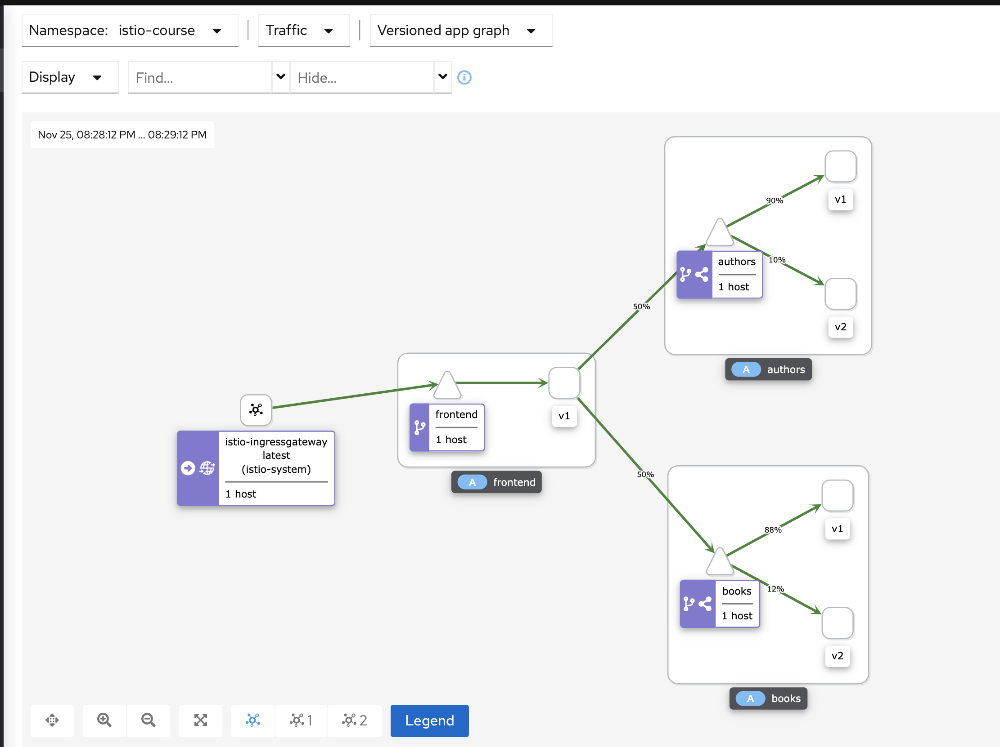

#### Build and push images to Docker Hub

Login to Docker Hub:

Enter each service folder, build image and push it to Docker Hub:
```bash
cd ./Project/authors
docker build -t katevoskresenska/authors-service-java:2.0 .
docker push katevoskresenska/authors-service-java:2.0

cd ./Project/books
docker build -t katevoskresenska/books-service-java:2.0 .
docker push katevoskresenska/books-service-java:2.0
```


#### Canary deployment

Create Kubernetes Deployment to deploy version 2 of books - ./Project/k8s/deployments/book.yaml
```bash
kubectl apply -f k8s/deployments/book.yml  
```
Create Kubernetes Deployment to deploy version 2 of authors - ./Project/k8s/deployments/author.yaml
```bash
kubectl apply -f k8s/deployments/author.yml  
```


Create virtual services and destination rules for authors and books
```bash
kubectl apply -f k8s/gateway/canary10_90.yml  
```


Check traffic distribution in Kiali dashboard
```bash
for i in $(seq 1 100); do curl -s -o /dev/null "http://localhost/frontend-catalog/api/v1/dashboard"; done
istioctl dashboard kiali 
```


Change weight in virtual hosts to 50/50
```bash
kubectl apply -f k8s/gateway/canary50_50.yml  
```


Pass all traffic v2 of books and authors
```bash
kubectl apply -f k8s/gateway/canary0_100.yml  
```


#### Feature Flag
Create virtual services and destination rules for authors and books with match http header
```bash
kubectl apply -f k8s/gateway/feature_flag.yml  
```
Enter frontend pod to check if it works
```bash
kubectl -n istio-course exec -ti frontend-v1-844444cb-65dzr -- sh 
curl http://authors:8080/api/v1/authors
curl http://authors:8080/api/v1/authors -H "developer: Katyu"
curl http://books:8080/api/v1/books 
curl http://books:8080/api/v1/books -H "developer: Katyu"
```


