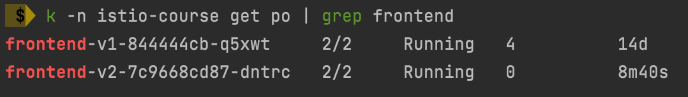
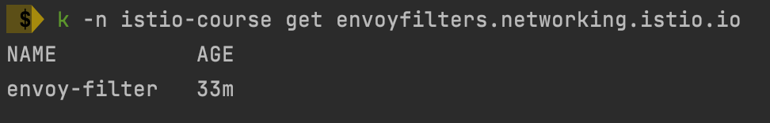
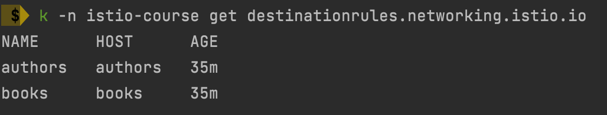
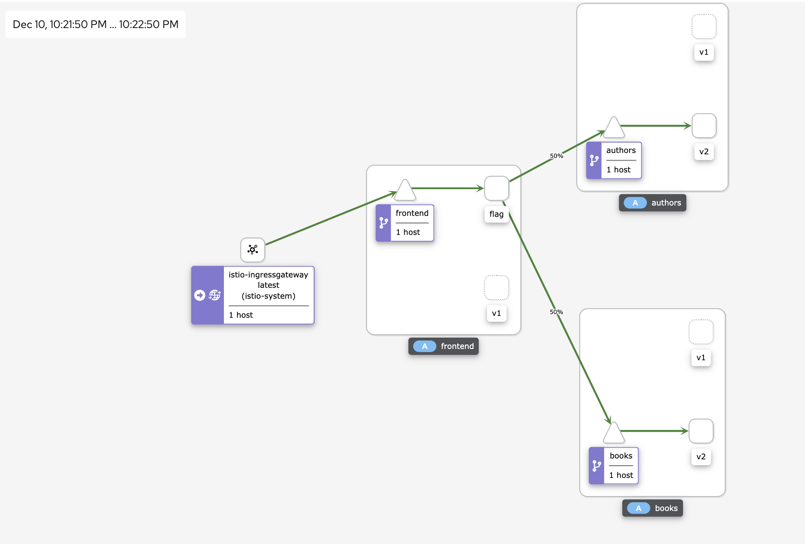
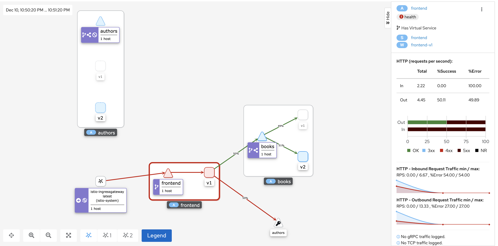
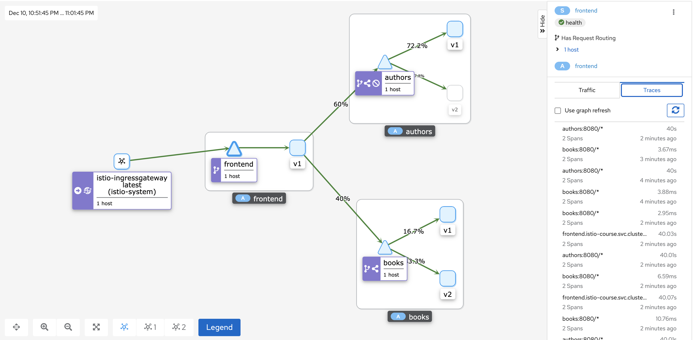

#### Envoy filter

Create frontend service with label - ```version: flag```
So, envoy filter could match this label and add header to further requests
```bash
kubectl apply -f k8s/deployments/frontend.yml  
```

Create envoy filter
```bash
kubectl apply -f k8s/gateway/envoy_filter.yml 
```

Check destination rules

Create destination rule for frontend and add header match to cource-istio vs
```bash
kubectl apply -f k8s/gateway/frontend_dr.yml 
kubectl apply -f k8s/gateway/course-gateway-controller.yml
```

Check if requests are passed correctly
```bash
for i in $(seq 1 100); do curl -s -o /dev/null "http://localhost/frontend-catalog/api/v1/dashboard" -H "developer: katyu"; done
```



#### Author service fault injection 

Delete envoy filter and frontend-v2 deployment. Update virtual services for authors, books and all hosts.
```bash
kubectl -n istio-course delete deploy frontend-v2  
kubectl -n istio-course delete envoyfilters.networking.istio.io envoy-filter
kubectl apply -f k8s/gateway/author-fault.yml
```


#### Author service delay injection
Update virtual services for authors
```bash
kubectl apply -f k8s/gateway/author-delay.yml
```

