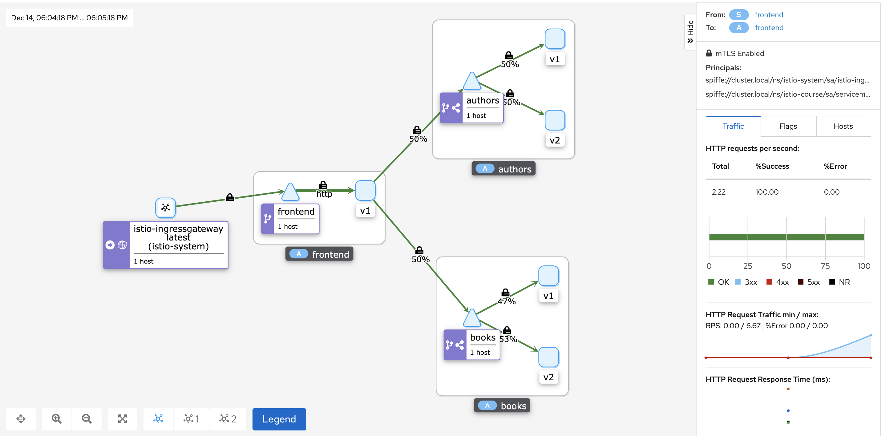
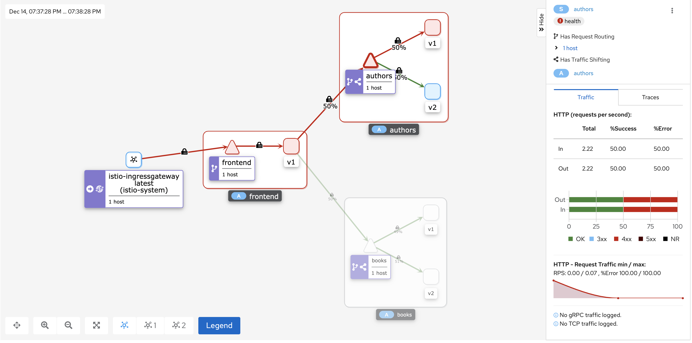

#### Security in Istio

https://istio.io/docs/tasks/security/ 
https://istio.io/latest/docs/tasks/security/authorization/authz-jwt/

Set a peer authentication policy for istio-course namespace
```bash
kubectl apply -f security.yml
```


Enable request authentication and set deny rule for authors v1:
```bash
kubectl apply -f security.yml
```
